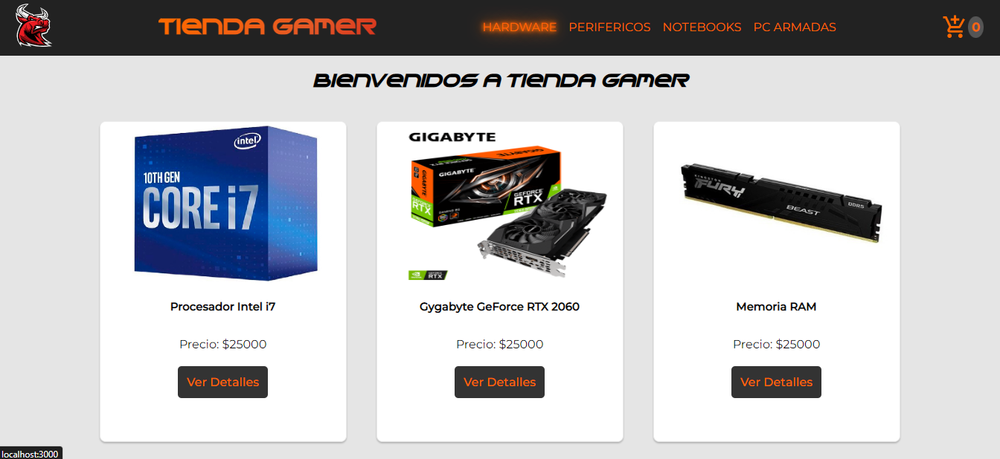
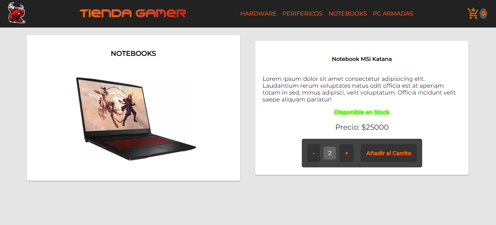
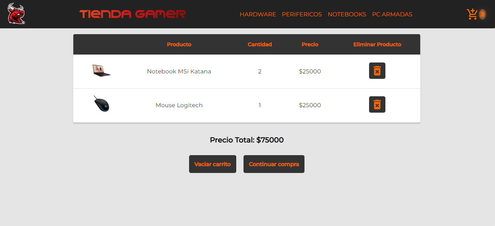
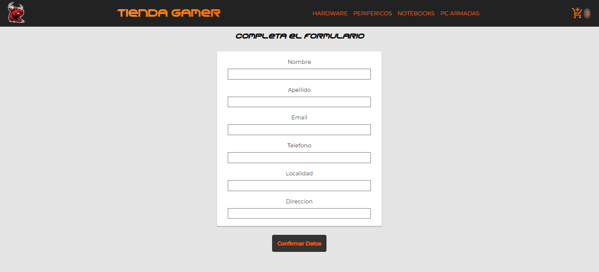

# Proyecto E-Commerce Tienda Gamer

Mi nombre es Nicolás Torres, este proyecto presenta el desarrollo de un E-commerce de una tienda ficticia de productos de computacion/gamer.

---------------------------------------------------
## Objetivo

Desarrollar un e-commerce que simule la realidad utilizando React JS para presentarlo como proyecto final del Curso React JS de CoderHouse.

---------------------------------------------------
## Screenshots
#### Home Tienda Gamer

#### Detail Tienda Gamer

#### Cart Tienda Gamer

#### Form Tienda Gamer

---------------------------------------------------
## 🛠 Tecnologias Utilizadas

| Tecnologia | Uso                        |
| :--------  | :-------                   |
| HTML       | `Estructura y maquetación` |
| CSS        | `Estética y diseño`        |
| JavaScript | `Programación de funciones del e-commerce` |
| React.js   | `Interfaz de usuario (SPA)`|
| Node.js    | `Ejecución de JavaScript`  |
| Git        | `Control de versiones y repositorio` |
| Styled Components | `Librería de estilos para CSS` |
| Material Icons UI | `Libreria de iconos`|
| React Router DOM | `Navegacion entre componentes`|
| Firebase | `Base de datos personalizada del proyecto`|

---------------------------------------------------
## Links

* Link del repositorio: [Repositorio](https://github.com/nicot73/mi-proyecto-app-TorresAlvarez)

* Link a la Web: [Tienda Gamer](https://tiendagamer-nt.netlify.app/)